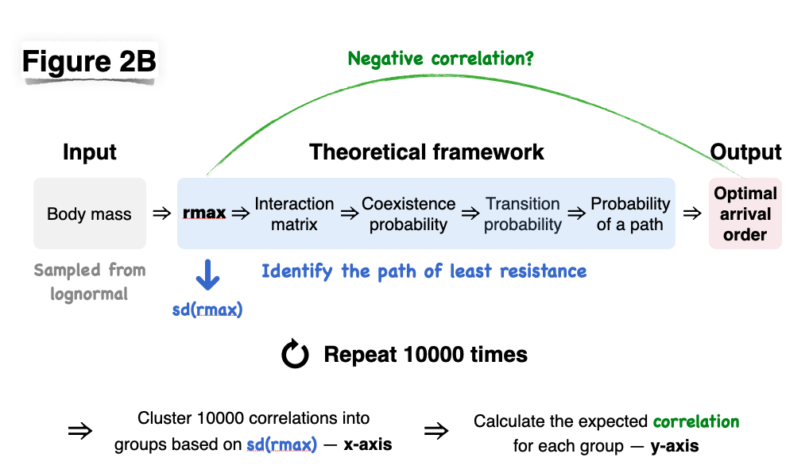

These are the codes in R accompanying the manuscript **The development of ecological systems along paths of least resistance** written by *Jie Deng, Otto X. Cordero, Tadashi Fukami, Simon A. Levin, Robert M. Pringle, Ricard Solé, and Serguei Saavedra*. The codes are well commented with simple examples.

Specifically, `toolbox.R` provides the functions to calculate the developmental probabilities (Fig. 2A) and the optimal path (Fig. 2B, Fig. 3) in our theoretical framework. Also, `example.R` illustrates an example of how to use the functions in `toolbox.R`. All codes were executed on the MIT SuperCloud (High-Performance Computing).

The flowchart illustrating the analysis in Figure 2B is presented below.

